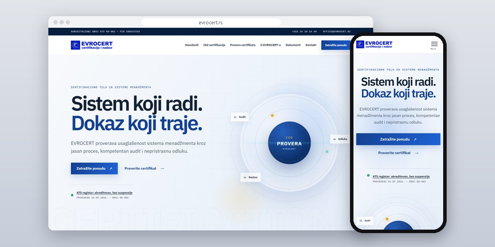
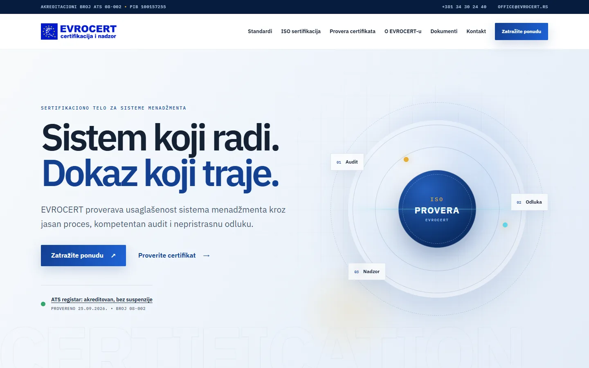
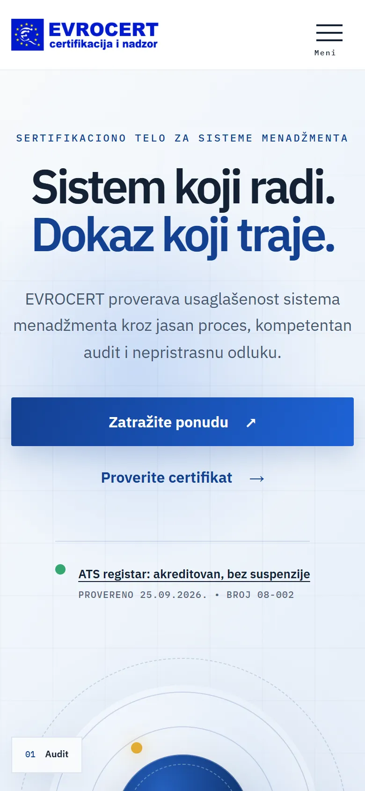
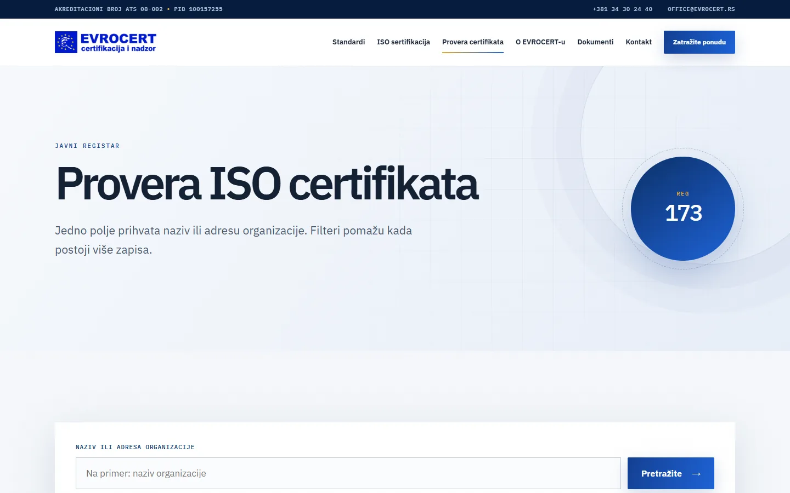
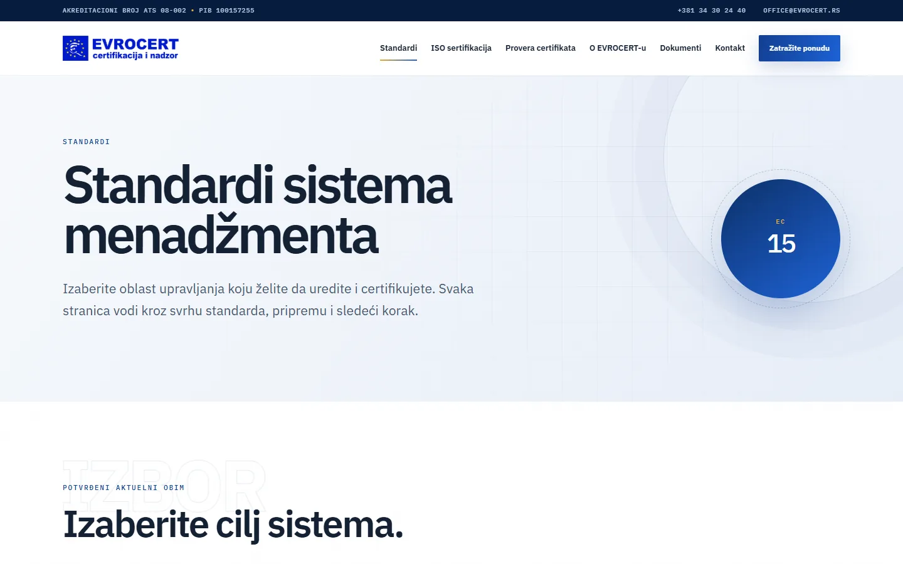

# EVROCERT

Sajt sertifikacionog tela iz Kragujevca, sa ISO standardima, postupkom sertifikacije i javnim registrom koji svako može da pretraži.

**[evrocert.rs](https://evrocert.rs/)** · [Studija slučaja](https://svilenkovic.rs/radovi/evrocert) · [English](README.md)

> [!NOTE]
> Klijentski projekat. Izvorni kod pripada klijentu i čuva se u privatnom repozitorijumu. Ova stranica opisuje šta sam uradio i kako.

<table>
  <tr><td><b>Klijent</b></td><td>EVROCERT</td></tr>
  <tr><td><b>Delatnost</b></td><td>Sertifikacija sistema menadžmenta (ISO 9001, 14001, 45001)</td></tr>
  <tr><td><b>Lokacija</b></td><td>Kragujevac</td></tr>
  <tr><td><b>Vrsta</b></td><td>Sajt sa više strana i javnim registrom</td></tr>
  <tr><td><b>Moj deo posla</b></td><td>Redizajn, izrada, selidba, hosting i održavanje</td></tr>
  <tr><td><b>Tehnologije</b></td><td>PHP 8.3, SQLite, Drupal (applications and accounts), nginx</td></tr>
</table>

## O projektu

EVROCERT sertifikuje sisteme menadžmenta i akreditovan je kod ATS-a, Akreditacionog tela Srbije. Na sajt dolaze dve vrste posetilaca: firma koja razmišlja o sertifikaciji i želi da zna šta je čeka, i kupac koji treba da proveri da li sertifikat dobavljača još važi. Javni sajt sam napravio iznova, oko ta dva pitanja.

Najviše pažnje je otišlo na registar. Javni sadržaj i registar sertifikata preneo sam iz starog Drupal sistema u novu SQLite bazu. Uvoz ide kroz privremenu bazu i jednu transakciju i prekida se ako se brojevi ne slažu sa izvorom (85 organizacija i 173 sertifikata). Status se računa na dan pretrage, pa se sertifikat kome je prošao datum važenja prikazuje kao istekao, čak i kad u starim podacima i dalje stoji kao aktivan.

## Šta sam uradio

- Posebne strane za ISO 9001, ISO 14001 i ISO 45001, a postupak razložen na prijavu, dve faze audita, nezavisnu odluku i nadzor
- Javni registar koji se pretražuje po nazivu ili adresi organizacije, sa filterima po standardu i statusu
- Rezultate sklapa server, pa pretraga radi i bez JavaScript-a
- Uvoz koji se ne završava ako se brojevi ne slažu sa starim sistemom; 36 sertifikata bez odgovarajuće organizacije sačuvano je tačno onako kako je zatečeno
- Politika sadržaja koja dozvoljava skripte i stilove samo sa istog domena
- Onlajn prijava, korisnički nalozi i EIS prijava ostali su u postojećem sistemu dok ne budu preneti sa istim mogućnostima

## Merenja

| | Performanse | Pristupačnost | Dobre prakse | SEO |
| :-- | :-: | :-: | :-: | :-: |
| Telefon | 100 | 100 | 100 | 100 |
| Desktop | 100 | 100 | 100 | 100 |

PageSpeed Insights, laboratorijsko merenje živog sajta, oktobar 2026. Sigurnosna zaglavlja: 6 od 6. HTML validator: bez grešaka. axe provera pristupačnosti: bez prekršaja. Strukturisani podaci: `Organization`.

## Snimci ekrana

<table>
  <tr>
    <td width="68%" valign="top"></td>
    <td width="32%" valign="top"></td>
  </tr>
</table>

Javni registar sertifikata sa pretragom po nazivu ili adresi

Tri standarda iz akreditovanog obima, svaki sa svojom stranom

---

Izrada: [D. Svilenković](https://svilenkovic.rs).
